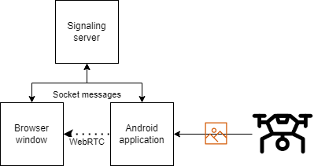

<a name="readme-top"></a>
<!-- PROJECT LOGO -->
<div align="center">
<h3 align="center">Stream DJI video on Android using WebRTC </h3>
  <p align="center">
    This is a library to get started with streaming the videofeed of DJI drones straight to your browser with low latency.
    <br />
    <a href="https://github.com/Andreas1331/android-webrtc-dji/tree/main"><strong>Explore the code</strong></a>
      <br />
      <p><i>INFO: This is only tested on DJI Mavic AIR 2S and DJI Mavic Enterprise</i></p>
  </p>
</div>

<!-- TABLE OF CONTENTS -->
<details>
  <summary>Table of Contents</summary>
  <ol>
    <li><a href="#about-the-project">About The Project</a></li>
    <li><a href="#flow-illustration">Flow Illustration</a></li>
    <li><a href="#prerequisites">Prerequisites</a></li>
    <li>
      <a href="#getting-started">Getting Started</a>
      <ul>
        <li><a href="#pre-setup">Pre-setup</a></li>
        <li><a href="#setup">Setup</a></li>
      </ul>
    </li>
    <li><a href="#license">License</a></li>
    <li><a href="#contact">Contact</a></li>
    <li><a href="#acknowledgments">Acknowledgments</a></li>
  </ol>
</details>


<!-- ABOUT THE PROJECT -->
## About The Project

Originally this library was created for a semester project, but seeing as I had a hard time finding examples of the exact setup I needed I decided to make my solution public. Hopefully this will help others in utilizing WebRTC to etablish connections between a client residing in a browser and an android application. 

The project consists of two components; one for the browser side and another for the android side. The browser side is to no surprise written in Javascript while the android side is Java. This solution is a one-way transmission of videofeed, meaning the android application is not expecting any video nor audio from the other peer. For my own project I needed video from an arbitrary number of drones to be displayed on an interactive dashboard using React. That is why there's a ```DroneStreamManager``` class on the browser side to handle connecting and closing of streams. On the android side it will not do much more besides keeping track of all its ongoing streams. You can do with that information as you please.

If you are not familiar with WebRTC you should be aware of a third component - the signaling server. I have by choice not included any project for this as you are free to implement that in whatever framework you decide. I will however include the few lines of code making up my own signaling server, as it really does not require much. You can just create a simple Node.JS socket server. The only purpose is to transmit messages between two peers until WebRTC has finalised a connection.

<p align="right">(<a href="#readme-top">back to top</a>)</p>

<!-- DEMONSTRATION -->
## Flow Illustration
The flow of information is as follows the client of both the browser and android must be connected to the signaling server. They will send messages to each other through the signaling server in order to start a WebRTC peer-to-peer connection. With the P2P started the android application will then extract the videofeed from the drone and transmit it using the established connection. Beaware if you put your android application to sleep to fly the drone the stream of video will pause as well. So either allow the application to run in the background or do not allow the application to sleep to fix this.
<p align="center"></p>

<p align="right">(<a href="#readme-top">back to top</a>)</p>

## Prerequisites
I used Socket.IO throughout all my projects, and you'll need the following at hand to proceed:

* Android application (tested on 'minSdkVersion 24', 'targetSdkVersion 30') 
* Any server that can act as the signaling server
* A website or just any barebone HTML file with a video tag and some Javascript code to invoke the call functions.

<p align="right">(<a href="#readme-top">back to top</a>)</p>

<!-- GETTING STARTED -->
## Getting Started
In order to get started just follow the steps below. Create your own HTML file with a video tag to stream the videofeed to, or use your existing project. That is up to you.

<p align="right">(<a href="#readme-top">back to top</a>)</p>

<!-- PRE SETUP -->
### Pre-setup

As mentioned before you will have to create your own signaling server, but I recommend a Node.JS socket server. The libraries (browser & android) have two dependencies, so make sure you include these as such:

In your index.html include the script tag
```
<script src="https://webrtc.github.io/adapter/adapter-latest.js"></script>
```
and in your android alter your gradle files. Add ```jcenter()``` as a repository. Then add the implementation to your dependencies.
```
implementation 'org.webrtc:google-webrtc:1.0.+'
```

Once you have your Node.JS server with a socket running, add the listener function for the event ```webrtc_msg```. 
```
socket.on("webrtc_msg", (receivee: string, msg: object) => {
    let from_id = socket.id;
    socket.to(receivee).emit('webrtc_msg', from_id, msg);
});
```

<p align="right">(<a href="#readme-top">back to top</a>)</p>

<!-- SETUP -->
### Setup

Copy the folder containing the Java files to your android application and alter the package name to fit your solution. You will notice that ```SocketConnection``` occurs a few places so modify that to use your own Socket handle. I will not include code for setting up sockets on android either.
Once the code has been merged with your own project you only need to instantiate the ```DJIStreamer``` somewhere it will persist in your application as such:
```
DJIStreamer streamer = new DJIStreamer(this);
``` 
That is it for the android part. You will not need to interact anymore with the instance of ```DJIStreamer```. All calls will be initiated from the browser window, and the android application will automatically accept any incoming calls.

Now the last thing is to include ```WebRTCManager.js``` in your HTML and before attempting to start any videofeed call the setup of socket events:
```
DroneStreamManager.setupSocketEvent(socket);
```
 and once you wish to call a drone in order to get its videofeed you invoke the function as such:
```
const ds = DroneStreamManager.createDroneStream(droneSocketId, videoTagID);
ds.startDroneStream();
```
We let the ```DroneStreamManager``` instantiate an instance of ```DroneStream``` for us and invoke the ```startDroneStream()``` afterwards. Please notice the arguments for creating a drone stream; the socket ID and the video tag ID. The socket ID will be the ID belonging to the android application that is assigned when connecting to our signaling server. This is to let our signaling server know where to pass the message when it receives it. We also provide the function with the ID of the HTML video tag, so the drone stream object knows which DOM element to stream the video to once it has it.

<p align="right">(<a href="#readme-top">back to top</a>)</p>

<!-- LICENSE -->
## License

Distributed under the MIT License. See `LICENSE.txt` for more information.

<p align="right">(<a href="#readme-top">back to top</a>)</p>


<!-- CONTACT -->
## Contact

Andreas  - **Website to be inserted**

<p align="right">(<a href="#readme-top">back to top</a>)</p>


<!-- ACKNOWLEDGMENTS -->
## Acknowledgments

* [A valueable example for setting up WebRTC on android](https://medium.com/@mehariaabhishek/how-to-use-webrtc-android-sdk-to-share-peer-to-peer-live-data-in-android-34b1aad1f1ba)

<p align="right">(<a href="#readme-top">back to top</a>)</p>
